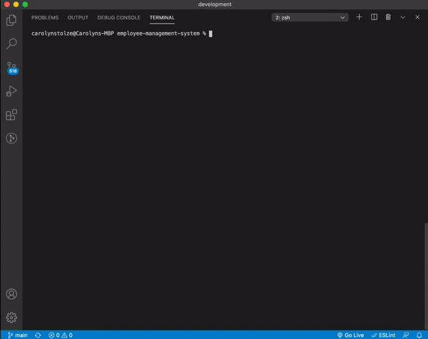

<!-- Badges: MAY NEED TO ADJUST LICENSE BADGE URL -->
  

<!--  -->
# Employee Management System   
 
- - -
- - -
### Organize your business by using this Content Management System (CMS) / command line interface to view and manage the departments, roles and employees of your company.

- - -
- - -

<!-- TOC -->
[Installation](#installation) // [How to Use](#how-to-use) // [Credits](#credits) // [Contributing](#contributing) // [License](#license) // [Questions & Feedback](#questions-feedback) 
  
## Installation
  
Run command `npm i` to install dependencies.

## How to Use 

Run command `node server` and follow the prompts to:  
• View departments, roles, employees  
• Add departments, roles, employees  
• Update employee roles  

## Credits
  
<!-- Third Party Asset Creators? Tutorials> // link to web presence -->
[Inquirer](https://www.npmjs.com/package/inquirer) // NPM CLI that generates questions  

## Contributing

<!-- The [Contributor Covenant](https://www.contributor-covenant.org/) is an industry standard. -->
Please contact me for guidelines.

## License
    
The code is licensed under the [MIT](https://choosealicense.com/licenses/mit/) License.
  
## Questions & Feedback
  
Have a question or feedback? Send me a note or just say hi, I'd be happy to hear from you!
  
Email: carolyn@carolynmary.com  
  
GitHub: [carolynmary](https://github.com/carolynmary)  
  
Porfolio: [carolynmary.com](https://carolynmary.com) 
  
> “Knowledge is having the right answer. Intelligence is asking the right question.” ~ Unknown
  
 

© 2020 Carolyn Mary Stolze